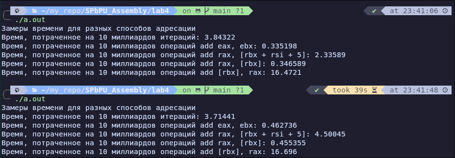

# Возможные проблемы в этой лабе

Компилятор может оптимизировать ваш код из-за чего выводы будут мягко говоря странные. Вот пример:

По логике самой быстрой должна быть регистровая адресация, но компилятор может это "исправить", скорее всего, из-за количества операций он кэширует чтение и делает что-то ещё. Важно! Ваш процессор сам может переупорядывачивать инструкции или создавать "шум" в расчётах (система может мигрировать поток с производительных P ядер на энергоэффективные E ядра). Можете ссылаться на гибридную архитектуру процессора, если она таковая
